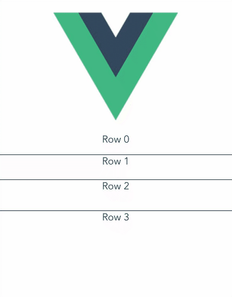

# vue3-virtualized

It was inspired by [react-window](https://github.com/bvaughn/react-window).




### Run example

```
cd examples
yarn install
yarn dev
```


### VariableSizeList

```vue
<template>
  <VariableSizeList
    :height="150"
    :item-size="getItemSize"
    :item-count="1000"
  >
    <template #default="{ data, index, key, isScrolling  }">
      <Row
        :index="index"
        :rowData="data"
        :isScrolling="isScrolling"
        @click="handleClickRow(data, index)"
      />
    </template>
  </VariableSizeList>
</template>

<script>
import { VariableSizeList } from 'vue3-virtualized'

const Row = {
  name: 'Row',
  props: {
    index: {
      type: Number
    },
    rowData: {

    },
  },

  setup(props) {
    return () => {
      return (
        <div style="border: 1px solid">Row {props.index}</div>
      )
    }
  }
};

const rowHeights = new Array(1000).fill(true).map(() => 25 + Math.round(Math.random() * 50));
const getItemSize = index => rowHeights[index];

export default {
  name: 'VariableSizeListDemo',
  components: {
    VariableSizeList,
    Row,
  },
  data() {
    return {
      rowHeights,
      getItemSize,
    }
  },
  methods: {
    handleClickRow(rowData, index) {
      console.log(`click row ${index}`)
    }
  }

}


</script>
```